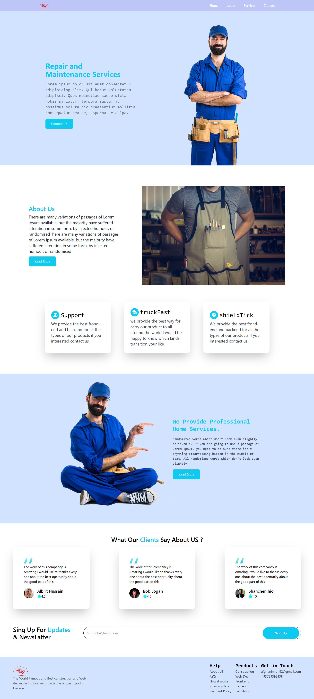

# 🏗️ Construction & Repair Services Landing Page - React Project

## 🚀 Project Overview

A modern, responsive landing page for construction and repair services built with React. This project showcases service offerings, client testimonials, and company information in an elegant layout.

---

## 🛠️ Technologies Used

- ⚛️ React.js
- 🎨 CSS3/Sass (or styled-components)
- 🔣 React Icons (for shieldTick, truckFast icons)
- 🚦 React Router (if multi-page)

## 📁 Folder Structure

```bash
hoobank/
├── public/
├── src/
│   ├── components/
│   ├── assets/
│   ├── App.jsx
│   └── index.js
├── tailwind.config.js
├── postcss.config.js
├── package.json
└── README.md
```

---

## 🧪 Features

- 💰 Stylish & modern banking UI
- 🔐 Secure payment methods section
- 📊 Real-time data and analysis mockups
- 📱 Mobile-friendly and fully responsive
- ✨ Smooth transitions and hover effects

---

## 📦 Installation

```bash
# Clone the repository
git clone https://github.com/imranmalakzai/repire.git
cd hoobank

# Install dependencies
npm install

# Start the development server
npm run dev
```

---

> Or update the image path in the README accordingly.

---

## 🌍 Live Demo

> 🔗 - https://construction-afg.netlify.app

---

## 🤝 Author

Made with ❤️ by **Imran Malakzai**  
📧 [afghanimran92@gmail.com]

---

## project image

- - 

## 📄 License

This project is open source and available under the [MIT License](LICENSE).
